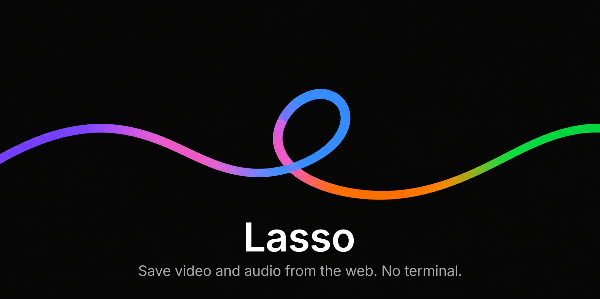
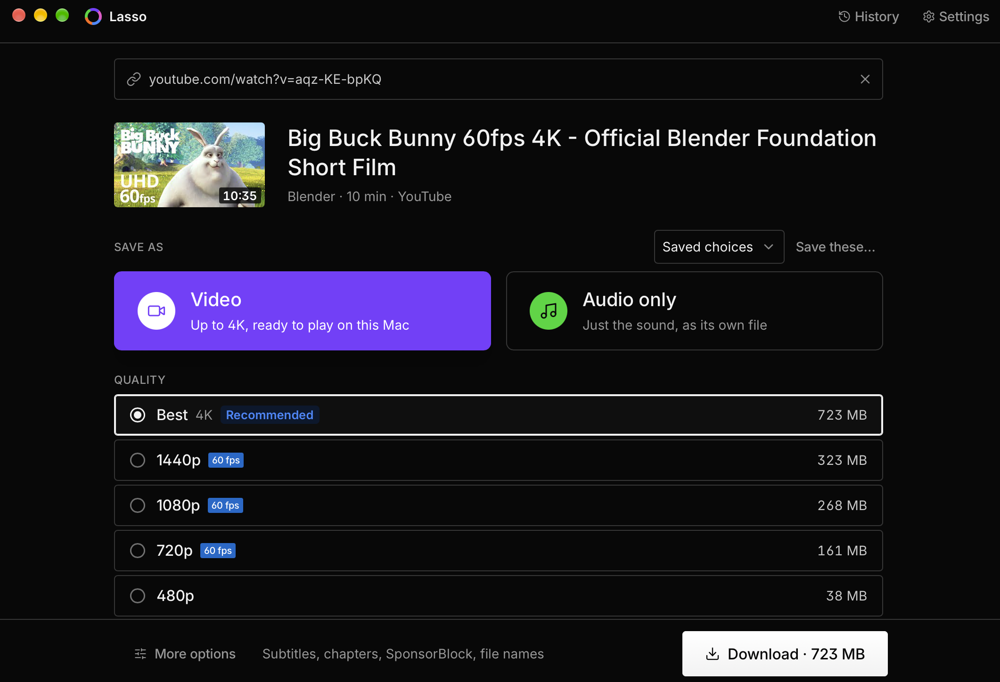

<p align="center"></p>

# Lasso

A small macOS app for saving video and audio from the web. Paste a link, pick a
quality, download.

It is a front end for [yt-dlp](https://github.com/yt-dlp/yt-dlp), and it brings
its own copy — along with ffmpeg, ffprobe and deno. Nothing to install, nothing
to keep up to date, no terminal.

> **Apple Silicon Macs.** The app is not code-signed yet, so the first launch
> needs one extra click. See [Install](#install).

## What it looks like

<p align="center"></p>

## Install

1. Download `Lasso.dmg` from the [latest release](https://github.com/swayyaam/lasso/releases/latest).
2. Open it and drag **Lasso** into **Applications**.
3. Open Lasso. macOS will refuse, saying it cannot verify the developer.
4. Go to **System Settings → Privacy & Security**, scroll to Security, and click
   **Open Anyway** next to the message about Lasso.
5. Open it again and confirm.

macOS remembers, so that is a one-time thing. It is what happens to any app
that has not been through Apple's paid signing process.

If macOS instead says Lasso **"is damaged and can't be opened"**, you have a
build from before v0.1.1, whose signature was broken by the build itself.
Download again from the [latest release](https://github.com/swayyaam/lasso/releases/latest).

The first launch takes a few seconds: Lasso copies its helper programs into
`~/Library/Application Support/Lasso` and lets macOS scan them. You will see a
setup screen while that happens.

## Using it

Paste a link. That is the whole first step: ⌘V works anywhere in the window,
and Lasso looks the link up straight away.

Then choose what to keep. **Video** or **Audio only**, one list of qualities
with the size of each, and a button that says what you will get —
**Download · 1.4 GB**. The download starts, the screen shows how far it has
got, and when it finishes it is one click to open or to show in the Finder.

### Picking a quality

The list only offers what the video really has. If there is no 4K encode, there
is no 4K row — so you can never pick something the download would quietly fail
to deliver.

**Best** is the best this Mac plays. QuickTime, Quick Look and Photos cannot
open some of YouTube's formats, and a file that will not open is not the best
of anything, so Best picks the largest one that plays here and saves it as
MP4. A larger encode that needs IINA or VLC stays in the list, marked as such.
On an M3 or later, which decode AV1 in hardware, Best is usually the top of the
ladder.

Rows carry a tag for anything notable: **HDR10**, **HLG** or **DV** for high
dynamic range, and **60 fps** for high frame rates.

If a site only offers you its lowest quality, Lasso says so rather than letting
it look like that is all the video has. Usually that means the site is holding
the good formats back until you are signed in — see [Signed-in
downloads](#signed-in-downloads).

### Audio and music

**Audio only** saves just the sound. **Original** is the one to reach for: it
takes the site's own audio stream and only changes the container around it.
Every other option re-encodes, and re-encoding audio that is already compressed
loses a little more.

That is worth knowing before you pick **FLAC**. FLAC is a lossless *format*, but
it cannot recover what a site already threw away — asking for it from YouTube
gives you a much larger file of exactly the same sound. Lasso tells you when
that is the case. On a source that genuinely serves lossless audio, FLAC does
what you would expect.

Two music options live under **More options → Music**:

- **Tag as music** fills in artist, title and year. A video called
  "Artist — Song" becomes those two fields; a site that already states a real
  artist is left alone.
- **Split chapters into tracks** turns one long "full album" upload into a file
  per chapter, each numbered and titled properly so a music library reads them
  as separate songs. The full recording is kept alongside them.

The **Music** and **Album** saved choices set these up for you.

### Playlists

A playlist opens as a list of its videos, all ticked. Untick the ones you do
not want and press **Download 12 videos**. Each becomes its own download, so
one failure does not stop the rest, and they land together in a folder named
after the playlist. On the downloads screen the playlist is one card with its
own progress; **Show all** lists every video.

### Saved choices

Five come built in: Best quality, Archive (MKV), Podcast audio, Music and
Album. Set things up the way you like and press **Save these…** to keep them
under a name. Rename and delete your own in **Settings**.

### While it downloads

The download in progress gets the screen: how much has arrived, how fast, and
how long is left. You can **pause** it and pick it up later — it resumes where
it stopped rather than starting over — or cancel it. If something fails, it
says why in a sentence and offers **Retry**, and diagnostics when the reason
looks like Lasso's own setup rather than the site's.

Quitting does not lose anything. Downloads that were waiting or running pick up
again the next time Lasso opens.

**History** keeps everything Lasso has saved, with its picture and date, and
you can search it by title, channel, site or format ("4K", "mp3"). From there
you can open a file, find it, or download it again with exactly the choices it
used before.

When something finishes, Lasso tells you, and the Dock icon counts what is
still going.

### Links from anywhere

Pasting is not the only way in:

- **Drop a link** on the window, from a browser's address bar or a page.
- **Drop a link or a `.webloc`** on Lasso's Dock icon, or open one with Lasso.
- **File → Paste Link** (⌘⇧V) opens whatever link is on the clipboard.
- **A bookmarklet** sends the page you are on. Make a bookmark with this as its
  address:

  ```
  javascript:location.href='lasso://open?url='+encodeURIComponent(location.href)
  ```

  The same `lasso://open?url=…` link works from Shortcuts.

Whichever way it arrives, a link opens on the choose screen and never starts a
download by itself. A link from another app is refused if it points at this Mac
or your local network.

### Keyboard

| Keys | Does |
|---|---|
| ⌘V | Open the link on the clipboard (anywhere in the window) |
| ⌘⇧V | The same, from the menu, even while typing in a field |
| ⌘↩ | Download what is chosen |
| Esc | Back out of a link |
| ⌘1 | Downloads |
| ⌘Y | History |
| ⌘, | Settings |

### Light or dark

Lasso follows your Mac's appearance and changes when it does.
**Settings → Appearance** keeps it light or dark whatever the Mac is set to.

### Signed-in downloads

Some videos need you to be signed in: private and members-only ones, anything
age-restricted, and increasingly YouTube's higher qualities. Lasso can borrow
the cookies from a browser you are already signed in to — **Settings → Cookies
from browser**.

Chrome, Firefox, Brave and Arc work straight away. **Safari needs Full Disk
Access**, because macOS keeps Safari's cookies somewhere apps cannot read
without it; Lasso will tell you and offer to open the right settings pane.

YouTube sometimes asks a whole network to prove it is not a bot — a VPN or a
busy office connection is the usual reason. Cookies from a signed-in browser
usually get past it; if they are on already, it tends to lift within the hour.

### More options

Everything yt-dlp can do is still there, behind **More options**: container
and codec preferences, HDR, subtitles (including auto-generated), SponsorBlock,
embedded chapters and artwork, a speed limit, and the filename template. At the
bottom, **Show the yt-dlp command** prints the exact command your choices
produce, so you can paste it into a terminal and get the same file.

## When something goes wrong

Most failed downloads are not about the link. **Settings → About &
diagnostics → Run the doctor** checks the things that actually break: whether
the helper programs run, whether your download folder exists and can be written
to, whether there is space, whether your browser's cookies can really be read,
and whether YouTube has lately refused this connection. It explains what it
finds and repairs what it can.

If a download fails in a way that looks like a setup problem rather than a bad
link, the failure offers **Diagnose** directly.

**Settings → About & diagnostics** checks for a new version of the app and installs it in
place, so updating does not mean downloading the disk image again and dragging
it over the old copy. Because the app installs it rather than a browser
downloading it, an update never has to be let past Gatekeeper — that one extra
click is only ever for the first install.

Sites change often, and yt-dlp changes with them. **Update yt-dlp** fetches the
newest version, checks that its checksums carry yt-dlp's own signature and that
the download matches them, proves it runs, and only then swaps it in. A failed
update leaves your working copy alone.

## Privacy

Lasso makes four kinds of network request and no others: yt-dlp's own traffic,
the yt-dlp updater, Lasso's own updater, and fetching thumbnails to show you.
Both updaters read GitHub's release files rather than its API, and only when
you open Settings or ask. There is no telemetry and no analytics, and
nothing is sent anywhere about what you download.

The [privacy policy](PRIVACY.md) lists every file Lasso keeps and every
connection it makes. The [terms of use](TERMS.md) cover what stays your
responsibility: mainly, that what you download is yours to download.

---

## Building from source

You need macOS, [Go](https://go.dev/dl/) 1.26+, [Node](https://nodejs.org/) 20+,
[pnpm](https://pnpm.io/) 10+ and [Wails](https://wails.io/) v2
(`go install github.com/wailsapp/wails/v2/cmd/wails@latest`, with
`$(go env GOPATH)/bin` on your `PATH`).

```bash
git clone https://github.com/swayyaam/lasso.git
cd lasso
make setup     # toolchain check, JS deps, fetch the helper binaries
make dev       # run it
```

`make build` produces `apps/desktop/build/bin/Lasso.app` and `make dmg`
packages it. `make help` lists the rest.

### How it is put together

```
apps/desktop/      Wails app (Go backend + React frontend)
packages/core/     yt-dlp arg builder, metadata, progress parsing, queue, tagging
packages/binaries/ helper-program install, verification, updates
packages/presets/  built-in and user presets
packages/history/  the record of finished downloads
packages/doctor/   diagnoses why a download failed, and repairs what it can
packages/ghrelease/ reads GitHub release files politely, without the API
packages/updater/  replaces Lasso with a newer release of itself
packages/ui/       shared React components + design tokens
```

`packages/core` has no Wails dependency, so it can be tested on its own.
`DESIGN-webflow.md` is the visual language.

### Helper binaries

Versions are pinned with SHA256 checksums in
[`binaries.lock.json`](binaries.lock.json), fetched and verified by
`scripts/fetch-binaries.sh`. They are never committed.

| Binary | Version | Source |
|---|---|---|
| yt-dlp | 2026.08.19 | GitHub release, `yt-dlp_macos.zip` (universal2, onedir) |
| ffmpeg | 9.0.1 | [ffmpeg.martin-riedl.de](https://ffmpeg.martin-riedl.de/) |
| ffprobe | 9.0.1 | [ffmpeg.martin-riedl.de](https://ffmpeg.martin-riedl.de/) |
| deno | 2.9.6 | GitHub release |

Lasso ships the **onedir** yt-dlp build rather than the single file. The
single-file one re-extracts a 37 MB archive on every run — about 5.8 seconds
each time — against roughly 0.16 seconds for onedir once macOS has scanned it.
That scan is warmed during install, so you never wait for it.

## Licence

[GPL-3.0](LICENSE).

Lasso ships an ffmpeg built with `--enable-gpl --enable-version3`, so the
distributed app is a GPLv3 work and is licensed to match. You are free to use,
study, change and share it, as long as anything you pass on carries the same
freedoms.

The programs it bundles keep their own licences: yt-dlp is
[Unlicense](https://github.com/yt-dlp/yt-dlp/blob/master/LICENSE), ffmpeg and
ffprobe are GPLv3 for this build, and deno is
[MIT](https://github.com/denoland/deno/blob/main/LICENSE.md). Every library
compiled into Lasso is listed with its licence in
[THIRD_PARTY_NOTICES.md](THIRD_PARTY_NOTICES.md), which also ships inside the
app and says where to get the source of the GPL programs.

What you download with Lasso is a separate matter: see the
[terms of use](TERMS.md) on copyright.
